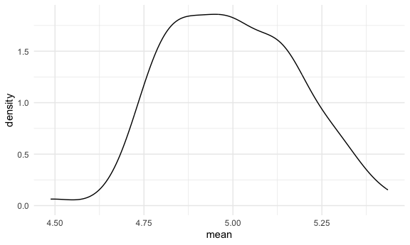
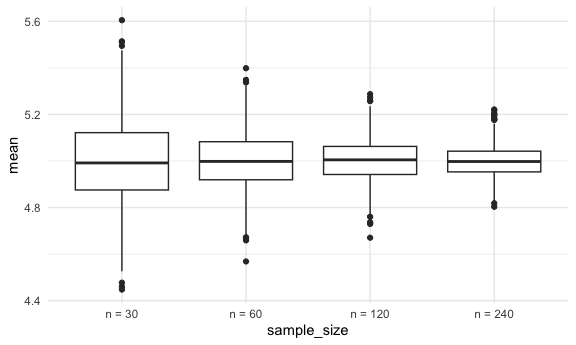
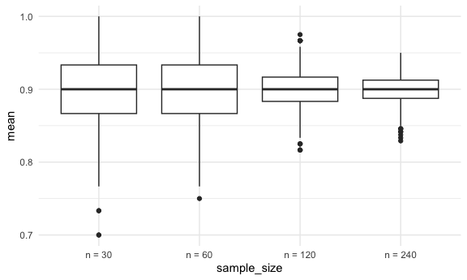

Simulations
================
Courtney Diamond
2023-11-14

## Simulate sample mean and sd

``` r
sim_mean_sd = function(n_obs,  mu = 5, sigma = 1) {
  
  x_vec = rnorm(n = n_obs, mean = mu, sd = sigma)

  tibble(
    mean = mean(x_vec),
    sd = sd(x_vec)
)
}
```

Let’s see what it does.

``` r
sim_mean_sd(n_obs = 30)
```

    ## # A tibble: 1 × 2
    ##    mean    sd
    ##   <dbl> <dbl>
    ## 1  5.08 0.938

Let’s iterate to see how this works.

``` r
output = vector("list", length = 100)

for (i in 1:100) {
  output[[i]] = sim_mean_sd(n_obs = 30)
}

sim_results = bind_rows(output)

sim_results |> 
  ggplot(aes(x = mean)) + geom_density()
```



``` r
sim_results |> 
  summarize(
    mu_hat = mean(mean),
    sd_hat = sd(mean)
  )
```

    ## # A tibble: 1 × 2
    ##   mu_hat sd_hat
    ##    <dbl>  <dbl>
    ## 1   5.00  0.180

Now let’s use a map function.

``` r
sim_result_df = 
  expand_grid(
    sample_size = c(30, 60, 120, 240),
    iter = 1:1000
  ) |> 
  mutate(estimate_df = map(sample_size, sim_mean_sd)) |> 
  unnest(estimate_df)

sim_result_df |> 
  mutate(sample_size = str_c("n = ", sample_size),
         sample_size = fct_inorder(sample_size)) |> 
  ggplot(aes(x = sample_size, y = mean)) +
  geom_boxplot()
```



``` r
sim_mean_sd_binom =  function(n_obs,  true_p = 0.9) {
  
  x_vec = rbinom(n = n_obs, size = 1, prob = true_p)

  tibble(
    mean = mean(x_vec),
    sd = sd(x_vec)
)
}

rbinom(30, size = 1, prob = 0.9)
```

    ##  [1] 1 1 1 1 1 1 1 1 1 1 1 1 1 1 1 1 1 0 1 0 1 1 1 1 1 1 1 1 1 1

``` r
sim_binom_result_df = 
  expand_grid(
    sample_size = c(30, 60, 120, 240),
    iter = 1:1000
  ) |> 
  mutate(estimate_df = map(sample_size, sim_mean_sd_binom)) |> 
  unnest(estimate_df)

sim_binom_result_df |> 
  mutate(sample_size = str_c("n = ", sample_size),
         sample_size = fct_inorder(sample_size)) |> 
  ggplot(aes(x = sample_size, y = mean)) +
  geom_boxplot()
```


